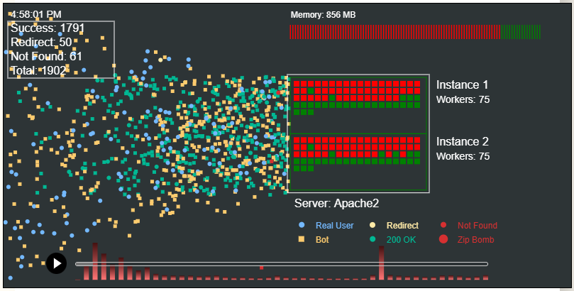

# reqvis

[](https://github.com/your-username/reqvis/stargazers)
[](https://github.com/your-username/reqvis/network/members)
[](https://github.com/your-username/reqvis/issues)
[](https://github.com/ibudiallo/reqvis/blob/master/LICENSE)

## 🚀 Overview

**reqvis** is a lightweight, browser-based tool that visualizes Apache server logs through interactive canvas renderings. Upload your logs and instantly see request patterns, traffic spikes, and response time distributions in an intuitive visual format that reveals insights traditional log analysis misses.



> ⚠️ **Note**: This project is currently under active development. Star and watch this repository to receive updates as features are implemented.

## ✨ Features

- **Simple Upload Interface**: Easily upload and parse Apache log files
- **Interactive Visualizations**: Analyze request patterns through dynamic JavaScript canvas visualizations
- **Customizable Views**: Filter and adjust visualizations to focus on specific metrics
- **Lightweight**: No heavy dependencies, runs in any modern browser

## Usage

This project is in active development. Star and watch this repository to be notified when the implementation is ready.

You can view a demo with a sample of my server data by checking the [public folder](public). Clone the repo and open the index.html file in your browser.

## 📊 Log Format Support

reqvis will support standard Apache log formats including:

- Common Log Format (CLF)
- Combined Log Format
- Custom log formats (documentation coming soon)

## 📝 How to Extract Apache Logs

To prepare your log files for visualization with reqvis:

1. Access your Apache server logs (typically found in `/var/log/apache2/` or `/var/log/httpd/`)
2. For large log files, consider extracting a relevant portion:

```bash
# Extract the last 1000 lines from access.log
tail -n 1000 /var/log/apache2/access.log > sample_logs.log

# Extract logs from a specific date range
grep "25/Apr/2025" /var/log/apache2/access.log > sample_logs.log
```

3. Remove any sensitive information if needed before uploading

## 🤝 Contributing

Interested in contributing? The project will be open for contributions soon! Check back for our contributing guidelines.

## 📜 License

This project is licensed under the MIT License - see the LICENSE file for details.

## 📞 Contact

Questions? Suggestions? Feel free to:

- Open an issue on GitHub
- Connect with us on [Twitter](https://twitter.com/dialloibu)
- Email us at github@idiallo.com

---

💙 Made with passion for the web development community